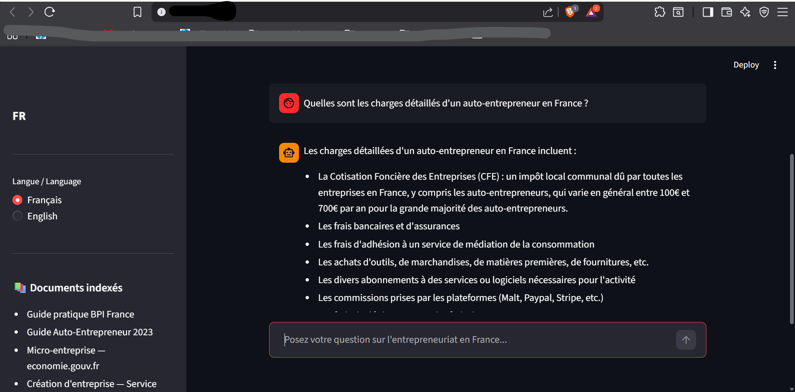
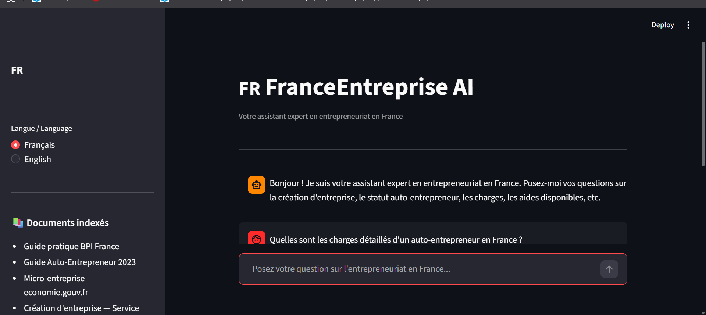

# 🇫🇷 FranceEntreprise AI

> Assistant conversationnel intelligent basé sur une architecture RAG pour répondre aux questions sur l'entrepreneuriat en France.



---

## 🎯 Présentation

**FranceEntreprise AI** est un agent RAG *(Retrieval-Augmented Generation)* qui permet à tout utilisateur de poser des questions en langage naturel sur :

- La création d'entreprise en France
- Le statut auto-entrepreneur / micro-entreprise
- Les charges et obligations fiscales
- Les aides et financements disponibles
- Les démarches d'immatriculation

L'agent répond uniquement à partir de **documents officiels français** (BPI France, URSSAF, economie.gouv.fr, service-public.fr) et cite toujours ses sources.

---

## 🏗️ Architecture

```
Question utilisateur
        │
        ▼
┌─────────────────┐
│   Streamlit UI  │  ← Interface de chat bilingue FR/EN
└────────┬────────┘
         │
         ▼
┌─────────────────┐
│    Retriever    │  ← ChromaDB + Embeddings multilingues
│   (ChromaDB)    │     sentence-transformers/paraphrase-
│                 │     multilingual-MiniLM-L12-v2
└────────┬────────┘
         │ Top-K chunks pertinents
         ▼
┌─────────────────┐
│   LLM (Groq)    │  ← Llama 3.3 70B via API Groq
│  Llama 3.3 70B  │
└────────┬────────┘
         │
         ▼
  Réponse + Sources
```

---

## 📁 Structure du projet

```
FranceEntreprise-AI/
├── app.py                  # Interface Streamlit bilingue
├── rag_pipeline.py         # Pipeline RAG : embeddings + LLM + chain
├── data_processing.py      # Chargement, nettoyage et chunking des PDFs
├── Base_documentaire/      # Documents PDF officiels indexés
├── requirements.txt        # Dépendances Python
├── .env                    # Clé API (non versionnée)
└── .gitignore
```

---

## ⚙️ Pipeline technique

### 1. Chargement & Nettoyage (`data_processing.py`)
- Chargement de tous les PDFs depuis `Base_documentaire/`
- Nettoyage : suppression des URLs, menus de navigation, doublons, lignes trop courtes
- Découpage en chunks (`chunk_size=1000`, `chunk_overlap=100`)
- Filtrage des chunks trop courts (< 200 caractères)

### 2. Indexation (`rag_pipeline.py`)
- Embeddings multilingues : `paraphrase-multilingual-MiniLM-L12-v2`
- Stockage vectoriel : **ChromaDB**
- Retriever : top-6 chunks les plus pertinents par similarité sémantique

### 3. Génération (`rag_pipeline.py`)
- LLM : **Llama 3.3 70B** via API **Groq**
- Prompt engineering : réponse uniquement basée sur les documents, avec fallback explicite si l'info est absente
- Détection automatique de la langue de la question

### 4. Interface (`app.py`)
- Chat conversationnel avec historique
- Interface bilingue Français / English
- Affichage des sources utilisées pour chaque réponse
- Chargement du pipeline en cache (`@st.cache_resource`)

---

## 🚀 Installation & Lancement

### Prérequis
- Python 3.11+
- Une clé API Groq gratuite : [console.groq.com](https://console.groq.com)

### Installation

```bash
# Cloner le repo
git clone https://github.com/lynaBoukari/FranceEntreprise-AI.git
cd FranceEntreprise-AI

# Installer les dépendances
pip install -r requirements.txt

# Configurer la clé API
cp .env.example .env
# Puis éditer .env et ajouter ta clé Groq
```

### Lancement

```bash
python -m streamlit run app.py
```

L'application s'ouvre automatiquement sur `http://localhost:8501`

---

## 📚 Documents indexés

| Source | Type | Pages |
|--------|------|-------|
| BPI France — Guide pratique du créateur | PDF natif | 69 |
| Guide Auto-Entrepreneur 2023 | PDF natif | 28 |
| Micro-entreprise — economie.gouv.fr | Web → PDF | 8 |
| Création d'entreprise — Service Public | Web → PDF | 14 |
| Immatriculation micro-entreprise — BPI | Web → PDF | 15 |
| Devenir micro-entrepreneur — Service Public | Web → PDF | 4 |

---

## 🛠️ Stack technique

| Composant | Technologie |
|-----------|-------------|
| Interface | Streamlit |
| Orchestration LLM | LangChain |
| LLM | Llama 3.3 70B (Groq) |
| Embeddings | sentence-transformers (HuggingFace) |
| Base vectorielle | ChromaDB |
| Chargement PDF | PyPDF |
| Langage | Python 3.11 |

---

## 💡 Choix techniques

**Pourquoi Groq ?** Pour le développement et la démo, Groq offre un accès gratuit et ultra-rapide à Llama 3.3. En production, ce serait remplacé par Azure OpenAI ou un modèle hébergé en interne pour des raisons de confidentialité des données.

**Pourquoi des embeddings multilingues ?** Les documents sont en français mais l'interface supporte l'anglais — un modèle multilingue garantit une recherche sémantique correcte dans les deux langues.

**Pourquoi chunk_size=1000 ?** Après expérimentation, 500 caractères coupait trop finement les informations juridiques. 1000 avec un overlap de 100 donne le meilleur équilibre précision/contexte.

---

## 👩‍💻 Auteure

**Lyna BOUKARI** — Data Scientist · IA Générative & LLMs

[GitHub](https://github.com/lynaBoukari) · [LinkedIn](https://linkedin.com/in/lyna-boukari)

---

## 📄 Licence

MIT License
